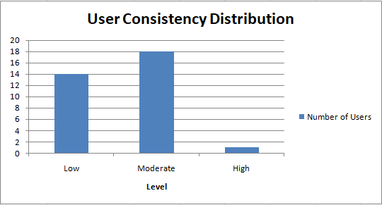

**Role:** Data Analyst  
**Tools & Techniques:** Microsoft Excel (Advanced Pivot Tables, Data Visualizations, Habit Consistency Modeling)  
**Scope:** Behavioral analysis of smart device usage data (Fitbit dataset)

# Bellabeat Case Study: Data-Driven Product Growth & Retention Strategy

## 📌 Executive Summary
**Bellabeat** is a high-tech manufacturer of health-focused products designed exclusively for women, including the **Bellabeat Leaf** (wellness jewelry), **Bellabeat Time** (smartwatch), **Bellabeat Spring** (smart water bottle), and the **Bellabeat App**.

This case study analyzes smart device usage data (**Fitbit dataset**) using **Microsoft Excel** to uncover behavioral patterns in activity, daily consistency, and sleep efficiency. The final deliverable translates data insights into **actionable Product Marketing and Retention strategies** designed to increase Customer Lifetime Value (CLV) and drive **Bellabeat Wellness Membership (Subscription)** growth.

---

## 🛠️ Data Analysis Process & Excel Methodology
The analysis was performed in **Microsoft Excel** across a structured multi-tab architecture:
* **Clean Data (`Clean_Daily_Activity`, `Clean_Sleep_Data`):** Performed data cleaning, including removing duplicates, formatting data types/dates, and removing inconsistent entries.
* **Activity Level Analysis (`Activity_Level_Analysis`):** Categorized users across 4 activity tiers (*Sedentary, Lightly Active, Fairly Active, Very Active*) to evaluate step volume.
* **Day of Week Analysis (`Day_Of_Week_Analysis`):** Measured daily movement patterns, identifying peak/min step days and calculating an **Aggregated Group Consistency Score (0.85)**.
* **User Consistency Analysis (`User_Consistency_Analysis`):** Evaluated habit stability at the individual User ID level, categorizing users into *Low, Moderate, and High Consistency* tiers.
* **Sleep Duration Analysis (`Sleep_Duration_Analysis`):** Evaluated sleep efficiency by comparing total time asleep versus time spent in bed.

---

## 📊 Key Data Findings

* **Activity Volume Gap:** "Very Active" users average **13,337 steps/day**, compared to just **2,128 steps/day** for "Sedentary" users.
* **The "Sunday Slump":** Movement peaks on Tuesdays (**~8,125 steps**) and Saturdays (**~8,153 steps**), but drops significantly on **Sundays (6,933 steps)**.
* **Individual Habit Instability (High Churn Risk):** While aggregate weekly consistency appears high (**0.85**), individual segmentation reveals high risk: **14 out of 33 users** have Low Consistency, **18** have Moderate Consistency, and **only 1 user** maintains High Consistency.
* **Sleep Latency Gap:** Users average **458 minutes (~7.6 hours)** in bed, but only **419 minutes (~7.0 hours)** asleep — leaving an unguided **~39-minute gap** of wakefulness in bed.

*(Chart showing individual habit stability breakdown across Low, Moderate, and High consistency tiers)*

---

## 💡 Strategic Recommendations for Business Growth

### 1. Gamified Consistency Micro-Challenges *(Retention & Cross-Sell)*
* **Insight:** 97% of users display Low/Moderate habit consistency, presenting a severe risk of device abandonment (churn).
* **Action:** Launch in-app **Consistency Micro-Challenges** (e.g., 3-day streak goals). Successful streaks earn rewards (**Bellabeat Gems**).
* **Business Value:** Gems can be redeemed for discounts on Hardware upgrades (e.g., **Bellabeat Spring** or **Bellabeat Time** smartwatch) or free subscription months, boosting Customer Lifetime Value.

---

### 2. "Sunday Self-Care & Hydration" Campaign *(Engagement)*
* **Insight:** Sunday marks the lowest activity point of the week (6,933 steps).
* **Action:** Deploy automated Sunday morning push notifications promoting low-impact activities (Light Yoga, Guided Breathing, and Hydration Tracking with the **Bellabeat Spring**).
* **Business Value:** Maintains app engagement during low-activity days and drives free-trial conversions for the **Bellabeat Wellness Membership**.

---

### 3. Bedtime "Wind-Down" Assistant *(Subscription Upsell)*
* **Insight:** Users spend ~39 minutes awake in bed before falling asleep.
* **Action:** Trigger automated bedtime relaxation prompts (Guided Sleep Meditations & Soundscapes) when inactivity in bed is detected.
* **Business Value:** Positions Bellabeat as a holistic wellness coach rather than a basic step tracker, justifying premium **Bellabeat Wellness Membership** pricing.
